# Assignment 3: Responsive Web Design

Name: Tolendi Meiirzhan  
Group: SE-2539

## How to open the project

Open `index.html` in a browser. All tasks are on this page. The portfolio cards link to the task sections.
Bootstrap is loaded from a CDN, so an internet connection is needed.
The contact email `tolendi@example.com` is an example address.

## Part 1: Media Queries

### Task 0: Responsive Typography

Section: `#task0` in `index.html`  
Styles: `style.css`

I created a page with headings and paragraphs. The font sizes change at 768px and 992px.

| Screen | Main heading | Second heading | Paragraph |
| --- | --- | --- | --- |
| Mobile: below 768px | 26px | 20px | 16px |
| Tablet: 768–991px | 34px | 24px | 18px |
| Desktop: 992px and above | 42px | 28px | 20px |

**Mobile (390px)**

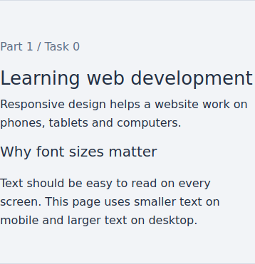

**Tablet (820px)**

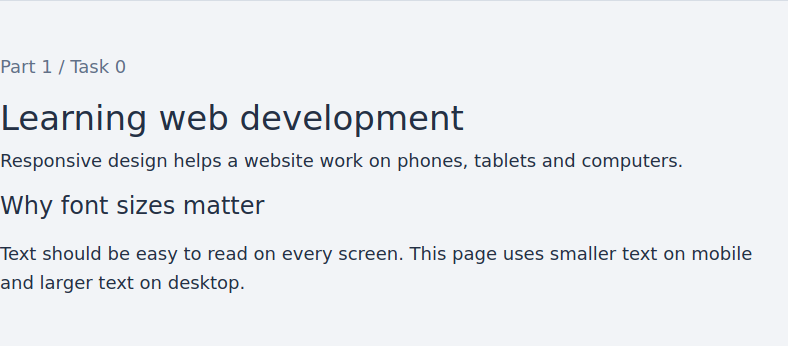

**Desktop (1280px)**

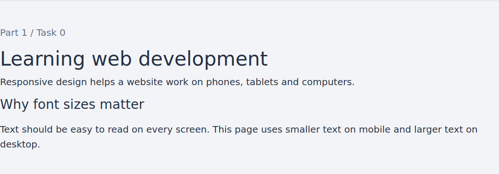

### Task 1: Responsive Layout with Media Queries

Section: `#task1` in `index.html`  
Styles: `style.css`

I used CSS Grid and media queries to arrange three boxes. On mobile, the boxes are stacked. On tablet, there are two boxes in the first row and one in the second row. On desktop, all three boxes are in one row. The boxes use custom CSS Grid rules and media queries, without Bootstrap layout classes.

**Mobile (390px)**

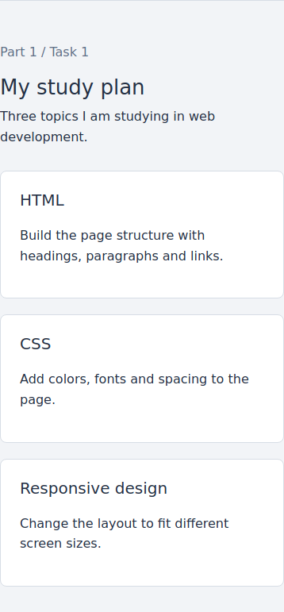

**Tablet (820px)**

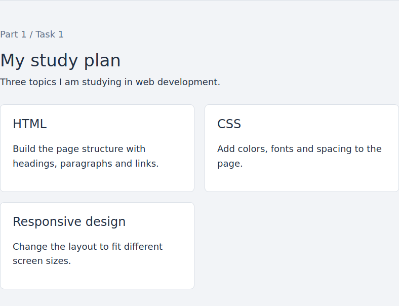

**Desktop (1280px)**

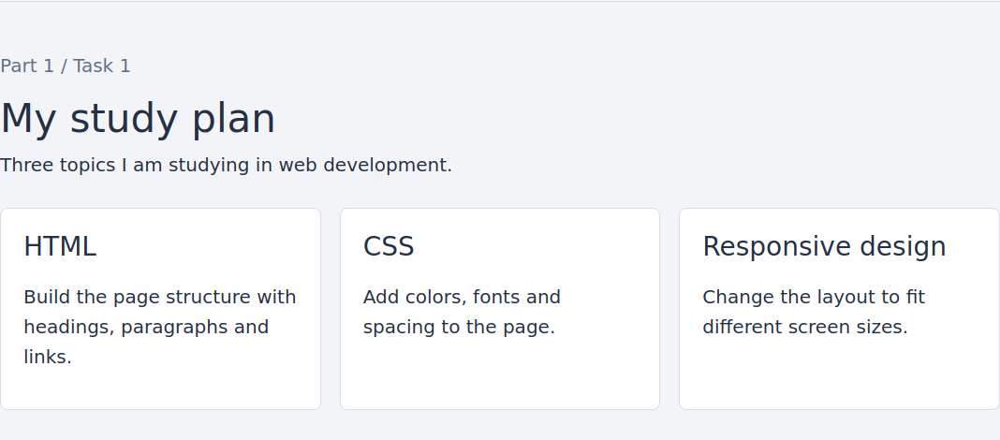

## Part 2: Bootstrap Grid System

### Task 2: Bootstrap Responsive Columns

Section: `#task2` in `index.html`

Each column has `col-12 col-md-6 col-lg-4`. On mobile, each column takes all 12 grid columns. From 768px, each takes 6 columns, so two fit in a row. From 992px, each takes 4 columns, so three fit in a row.

**Mobile (390px)**

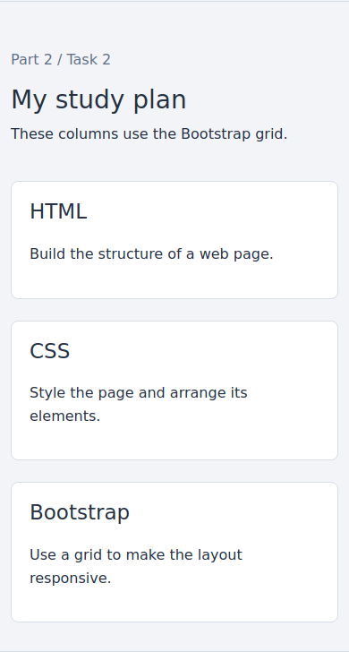

**Tablet (820px)**

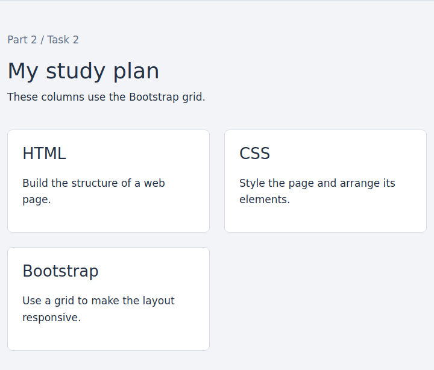

**Desktop (1280px)**

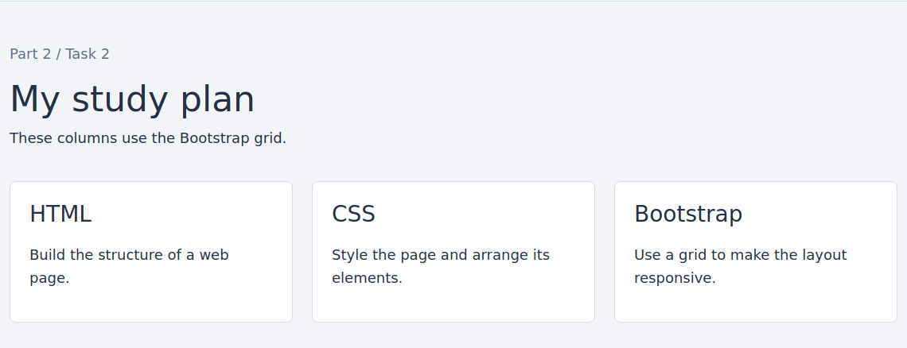

### Task 3: Bootstrap Navigation Bar

Header: `#task3` in `index.html`

I used one Bootstrap navbar for Task 3 and the portfolio in Task 4. It has the text logo on the left. The `ms-auto` class moves the links to the right on desktop. The `navbar-expand-lg` class keeps the menu collapsed below 992px. The button opens and closes the menu using the Bootstrap script.

**Mobile (390px)**

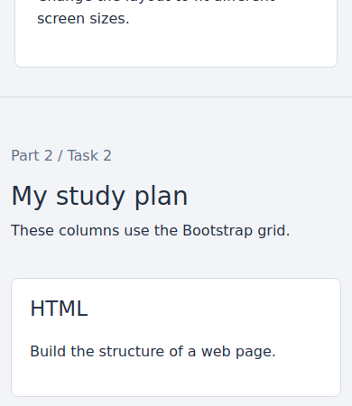

**Tablet (820px)**

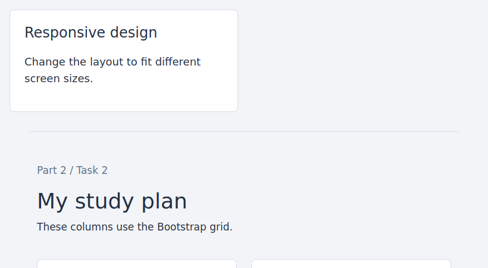

**Desktop (1280px)**

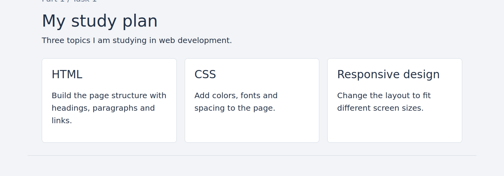

**Mobile with the menu open**

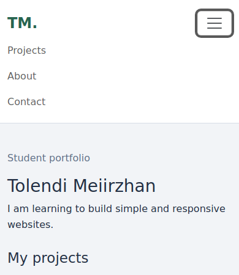

## Part 3: Combined Project

### Task 4: Responsive Portfolio Page

Section: `#task4` in `index.html`  
Styles: `style.css`

The portfolio has a Bootstrap navbar, project cards, a sidebar and a footer. On desktop, the projects take 8 grid columns and the sidebar takes 4. On smaller screens, the sidebar moves below the projects. The cards use `col-12 col-md-6`.

Custom media queries change the font sizes and spacing at 768px and 992px. The assignment note is visible on desktop and hidden on mobile and tablet. The footer is below the main section and spans the page width.

**Mobile (390px)**

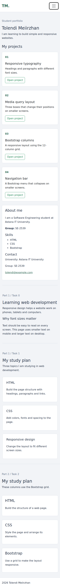

**Tablet (820px)**

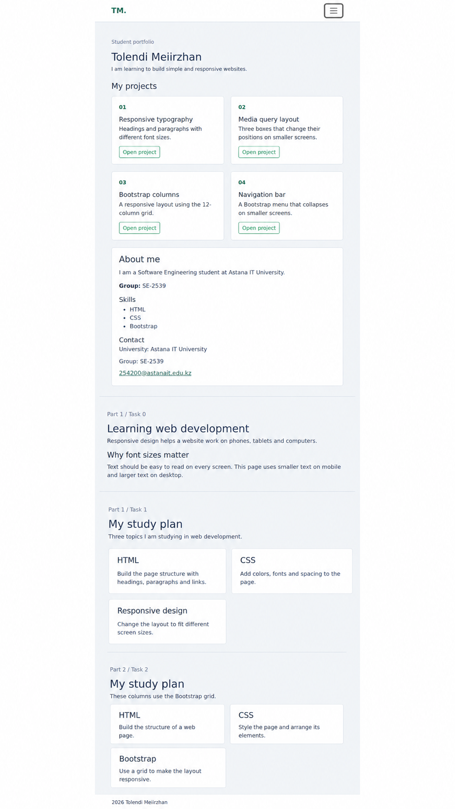

**Desktop (1280px)**

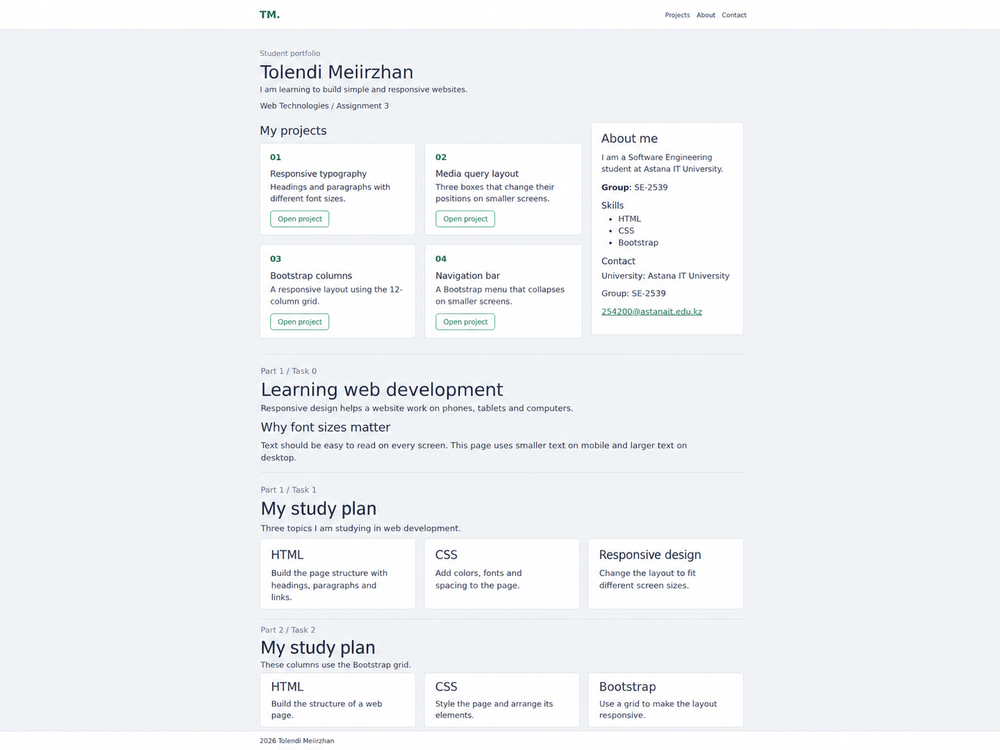

## Work process

First, I created the HTML sections in one file. Then I added CSS media queries for the text and boxes. After that, I used Bootstrap columns and a navbar. Finally, I combined these elements in the portfolio and checked the page at mobile, tablet and desktop widths. I also checked that the hamburger menu opens and closes.

## Resources

- [Bootstrap introduction](https://getbootstrap.com/docs/5.3/getting-started/introduction/)
- [CSS media queries](https://www.w3schools.com/css/css_rwd_mediaqueries.asp)
- [Responsive design](https://developer.mozilla.org/en-US/docs/Learn_web_development/Core/CSS_layout/Responsive_Design)
